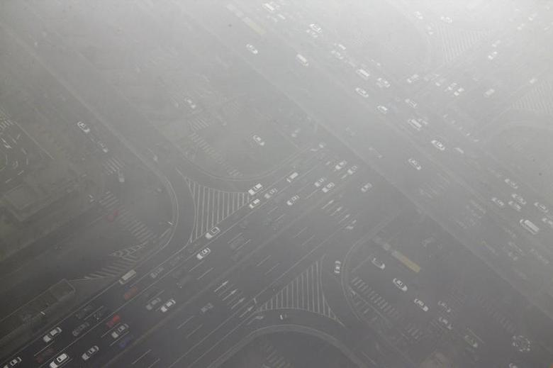
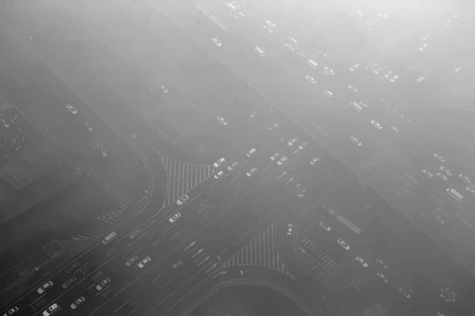

# Image Dehazing using Fourier Transform and Bilateral Filtering

This project demonstrates how to use Fourier Transform and Bilateral Filtering to remove haze from an image.

## Requirements

* Python 3.6+
* OpenCV
* numpy

## Installing

    Python: https://www.python.org/downloads/
    OpenCV: pip install opencv-python
    NumPy: pip install numpy

## Usage

* Run the dehaze.py script with the hazy image:
```bash
python dehaze.py -i <image_path>
```
> The script will display the original hazy image and the dehazed image.

* To display the magnitude spectrum of an image, run the following command:
```bash
python magnitude_spectrum.py -i <image_path>
```

* To display the phase spectrum of an image, run the following command:
```bash
python phase_spectrum.py -i <image_path>
```
> Replace <image_path> with the path of the image file you want to dehaze.

## Description

### The dehaze.py script performs the following steps:

  1. Load the input image in grayscale.
  2. Perform the Fourier Transform on the image.
  3. Shift the zero-frequency component to the center of the spectrum.
  4. Compute the magnitude spectrum and the phase spectrum.
  5. Apply a bilateral filter to the magnitude spectrum to attenuate the high-frequency components responsible for haze.
  6. Combine the attenuated magnitude spectrum with the phase spectrum.
  7. Perform the inverse Fourier Transform to get the dehazed image.
  8. Display the original image, the magnitude spectrum, the phase spectrum, and the dehazed image.

### The magnitude_spectrum.py script performs the following steps:
 
  1. Load the image in grayscale.
  2. Perform Fourier Transform.
  3. Shift the zero frequency component to the center of the spectrum.
  4. Calculate the magnitude spectrum.
  5. Normalize the magnitude spectrum.
  6. Display the magnitude spectrum.
 
### The phase_spectrum.py script performs the following steps:

  1. Load the image in grayscale.
  2. Perform Fourier Transform.
  3. Shift the zero frequency component to the center of the spectrum.
  4. Calculate the phase spectrum.
  5. Normalize the phase spectrum.
  6. Display the phase spectrum.
    
## Results

Here are some sample results obtained from the algorithm:

### Input Image



### Dehazed Image


